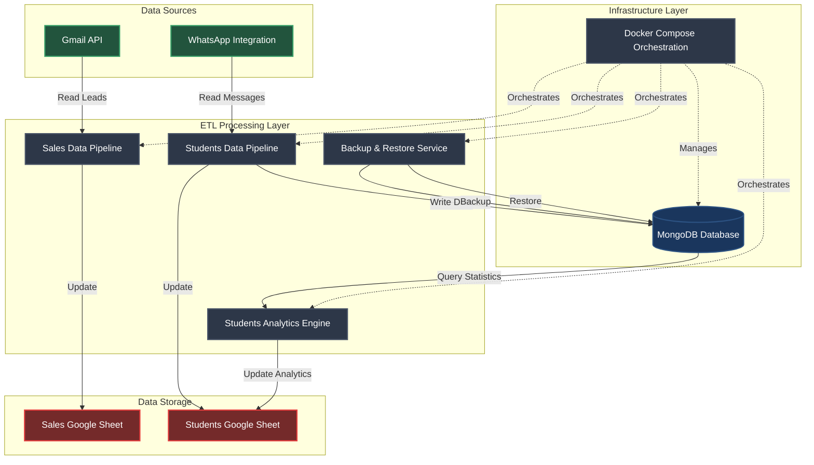

# Project Architecture

```mermaid
graph TB
    subgraph Infrastructure["Infrastructure Layer"]
        MongoDB[(MongoDB Database)]
        DockerCompose[Docker Compose Orchestration]
    end

    subgraph ETL["ETL Processing Layer"]
        SalesETL[Sales Data Pipeline]
        StudentsETL[Students Data Pipeline]
        StudentsCalc[Students Analytics Engine]
        BackupRestore[Backup & Restore Service]
    end

    subgraph DataSources["Data Sources"]
        Gmail[Gmail API]
        WhatsApp[WhatsApp Integration]
    end

    subgraph Storage["Data Storage"]
        SalesSheet[Sales Google Sheet]
        StudentsSheet[Students Google Sheet]
    end

    Gmail -->|Read Leads| SalesETL
    SalesETL -->|Update| SalesSheet
    
    WhatsApp -->|Read Messages| StudentsETL
    StudentsETL -->|Write Data| MongoDB
    StudentsETL -->|Update| StudentsSheet
    
    MongoDB -->|Query Statistics| StudentsCalc
    StudentsCalc -->|Update Analytics| StudentsSheet
    
    BackupRestore -->|Backup| MongoDB
    BackupRestore -->|Restore| MongoDB
    
    DockerCompose -.->|Orchestrates| SalesETL
    DockerCompose -.->|Orchestrates| StudentsETL
    DockerCompose -.->|Orchestrates| StudentsCalc
    DockerCompose -.->|Orchestrates| BackupRestore
    DockerCompose -.->|Manages| MongoDB

    classDef container fill:#2d3748,stroke:#4a5568,stroke-width:2px,color:#fff
    classDef database fill:#1a365d,stroke:#2c5282,stroke-width:2px,color:#fff
    classDef source fill:#22543d,stroke:#38a169,stroke-width:2px,color:#fff
    classDef storage fill:#742a2a,stroke:#e53e3e,stroke-width:2px,color:#fff
    
    class SalesETL,StudentsETL,StudentsCalc,BackupRestore,DockerCompose container
    class MongoDB database
    class Gmail,WhatsApp source
    class SalesSheet,StudentsSheet storage
```
